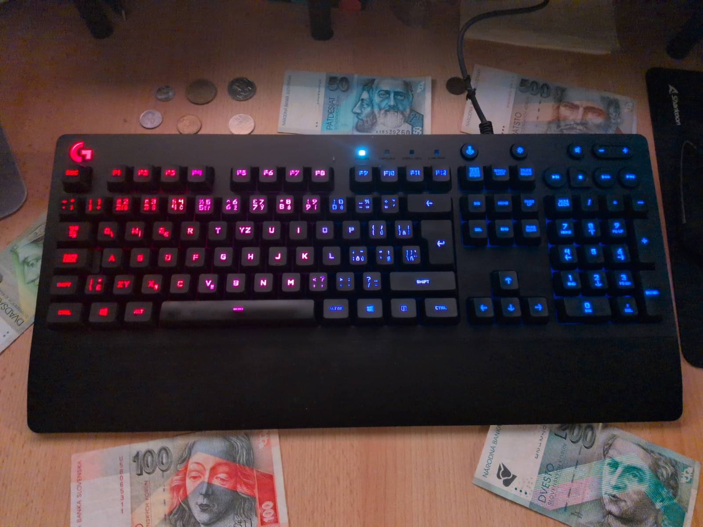
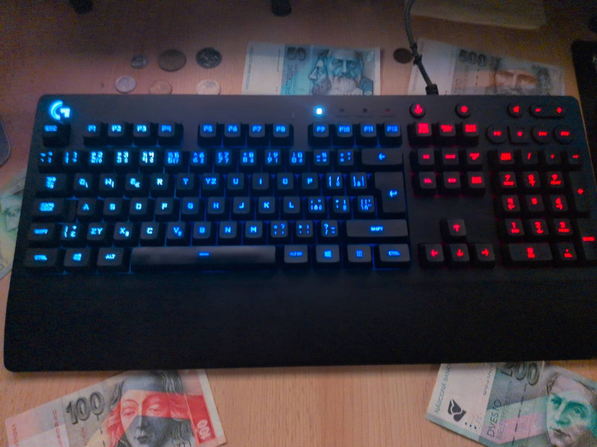
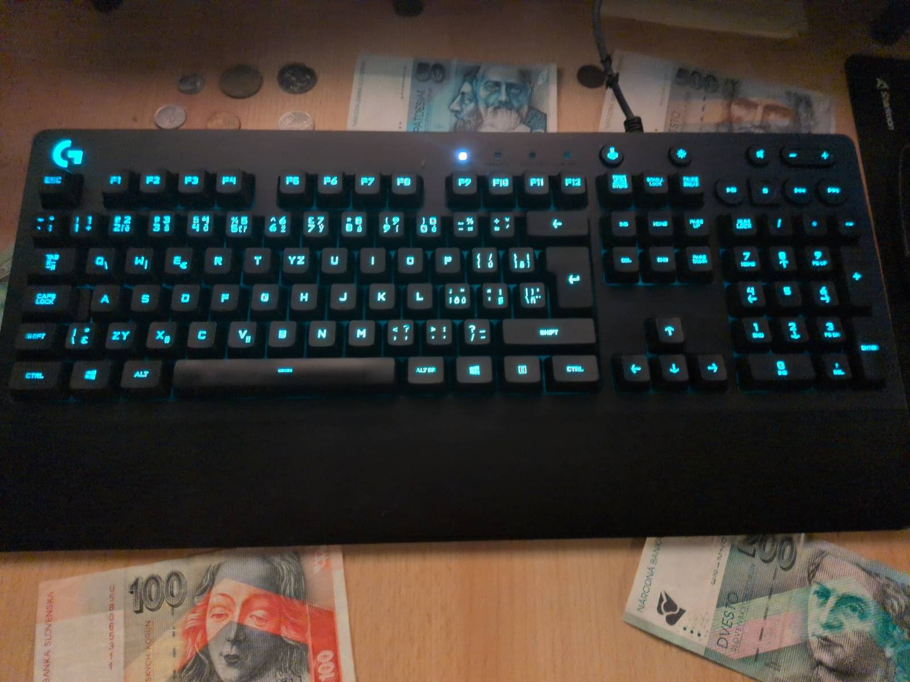
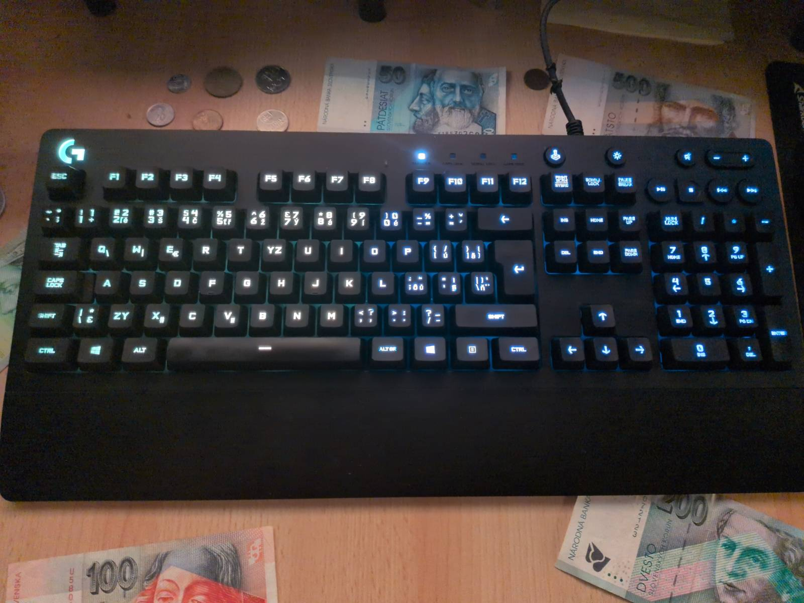
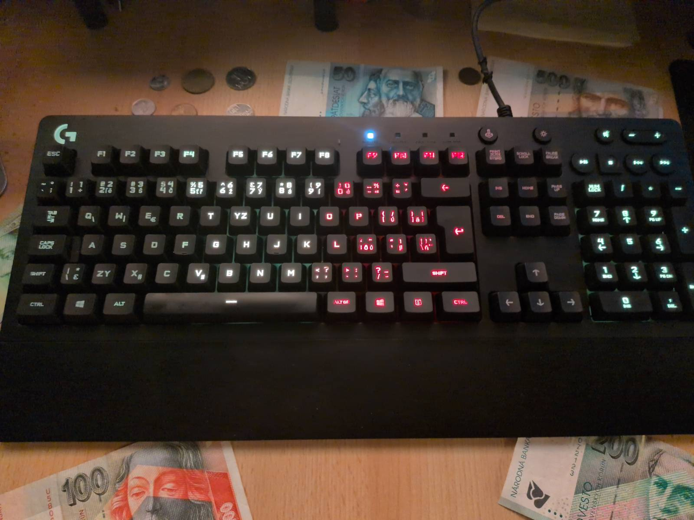

# ✨ lux

A friendly CLI wrapper for [g213-led](https://github.com/SebiTimeworx/g213-led) to control Logitech G213 Prodigy keyboard lighting with presets, gradients, and more.

<p align="center">
  
  
</p>

## Features

- 🏳️ **Named presets** — Apply country flags, royal colors, and special effects with simple names
- 🎨 **Custom colors** — Set any RGB hex color
- **Gradients** — Smooth color transitions across keyboard zones
- 🔄 **Rotation mode** — Cycle through presets automatically
- 🎲 **Random mode** — Surprise yourself with random colors, gradients, or presets
- 🏷️ **Aliases** — Multiple names for the same preset (e.g., `USA`, `Murica`, `FREEDOM` 🦅)

## Requirements

- Python 3.10+
- [g213-led](https://github.com/SebiTimeworx/g213-led) installed and in PATH

## Installation

```bash
git clone https://github.com/mrscooter/lux.git
cd lux
chmod +x lux

# Optional: add to PATH
sudo ln -s $(pwd)/lux /usr/local/bin/lux
```

## Usage

### Apply a preset

```bash
lux Slovakia          # 🇸🇰 Slovak flag (also: slovakia, Slovensko, slovensko)
lux Vatican           # 🇻🇦 Vatican flag (also: Vaticano)
lux royal-blue        # 🔵 Solid color
```

### List all presets

```bash
lux -l
lux --list
```

### Custom RGB color

```bash
lux -rh ff0000        # 🔴 Solid red
lux --rgbhex 00ff00   # 🟢 Solid green
```



### Gradient

```bash
lux -g ff0000 0000ff        # 🔴 ➜ 🔵 Red to blue
lux --gradient ff0000 0000ff
lux -g ff0000 0000ff -v     # Verbose: shows each zone color
```


### Random mode

```bash
lux -R                # 🎰 Full surprise: random preset, color, zones, or gradient
lux -R flag           # 🏳️ Random flag preset
lux -R color          # 🎨 Random color preset
lux -R preset         # Random preset from all categories
lux -R -v             # Verbose: shows what was picked
```

### Rotation mode

```bash
lux -r flags          # Cycle through all flag presets
lux -r colors         # Cycle through all color presets
lux -r flags -i 3     # 3 second interval (default: 5)
lux -r flags -v       # Verbose: shows current preset
```

### Options

| Option | Short | Description |
|--------|-------|-------------|
| `--list` | `-l` | List all available presets |
| `--rgbhex RRGGBB` | `-rh` | Apply raw RGB hex color |
| `--gradient LEFT RIGHT` | `-g` | Apply gradient between two colors |
| `--random [CATEGORY]` | `-R` | Random mode (flag/color/preset/all) |
| `--rotate CATEGORY` | `-r` | Rotate through presets (flags/colors) |
| `--interval SECONDS` | `-i` | Rotation interval (default: 5) |
| `--verbose` | `-v` | Show detailed output |

## Available Presets

### Flags
🇸🇰 Slovakia · 🇺🇸 USA · 🇻🇦 Vatican · 🇵🇱 Poland · 🇭🇷 Croatia · 🇧🇹 Bhutan · 🇲🇳 Mongolia · 🇺🇬 Uganda

<p>
  
  
  
</p>

### Colors
🔵 royal-blue · 💚 emerald-green · 🍷 bordeaux · ❤️ royal-red · 💜 royal-purple
🥇 gold · 💎 sapphire · ❤️‍🔥 ruby · 🔮 amethyst · 🤍 ivory · 🍇 burgundy · 🌊 navy · 🥉 bronze

### Special
🌈 rainbow · 💚 magic-green (aka `i-am-hacker` 🧑‍💻)

Run `lux -l` for the full list with aliases.

---

## For Developers

### Project Structure

```
lux
├── lux                    # Entry point script
└── lux_core/
    ├── __init__.py
    ├── cli.py             # Argument parsing and main logic
    ├── presets.py         # Preset definitions
    └── runner.py          # g213-led subprocess wrapper
```

### Adding a preset

Edit `lux_core/presets.py` and add to `_PRESET_DEFINITIONS`:

```python
# Solid color
{
    "aliases": ["my-color", "mycolor"],
    "description": "Optional description",
    "category": PresetCategory.COLOR,
    "type": "solid",
    "color": "ff00ff",
},

# Multi-zone (5 zones, left to right)
{
    "aliases": ["my-flag"],
    "description": "My country flag",
    "category": PresetCategory.FLAG,
    "type": "regions",
    "colors": ["ff0000", "ffffff", "0000ff", "ffffff", "ff0000"],
},
```

Categories: `PresetCategory.FLAG`, `PresetCategory.COLOR`, `PresetCategory.SPECIAL`

### How it works

`lux` is a thin wrapper around `g213-led`. It translates presets into `g213-led` commands:

- Solid colors: `g213-led -a RRGGBB`
- Per-zone colors: `g213-led -r 1 COLOR1 && g213-led -r 2 COLOR2 ...`

The keyboard has 5 lighting zones (left to right).

---

## 🍺 License

```
THE BEER-WARE LICENSE (Revision 42):
mrscooter89@proton.me wrote this file. As long as you retain this notice
you can do whatever you want with this stuff. If we meet some day, and you
think this stuff is worth it, you can buy me a beer in return. 🍻
```
